# ITP4523M Internet & Multimedia Applications Development

## Scenario

1. Objectives

    - build a web application which provide different functions for salesperson and manager.

    - apply software development skills to develop a website which is user-friendly, interactive, robust, and easy to maintain.

    - apply the knowledge that you learned in this module to solve the tasks. (i.e., HTML, CSS, JavaScript, PHP, SQL commands and Python)

2. A simplified procedure to show how the web application will be used. There are two user roles for the management System:
    1. Salesperson can place orders and manage customer accounts.
    2. Manager can manage items and review customer’s order.

## Get Started

1. Clone the project

    ```bash
    git clone git@github.com:Ryuuu825/ITP4523M-2022.git
    ```

2. import the database file `./createProjectDB.sql` to your mysql database
3. change the database setting in `./web/php/conn.php`
4. start the database
5. start the server

    ```bash
    php -S localhost:8000
    ```

## Screenshots

- Place Orders
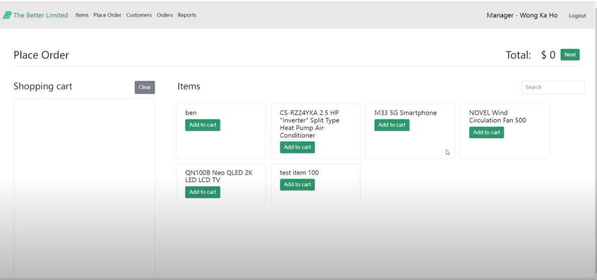
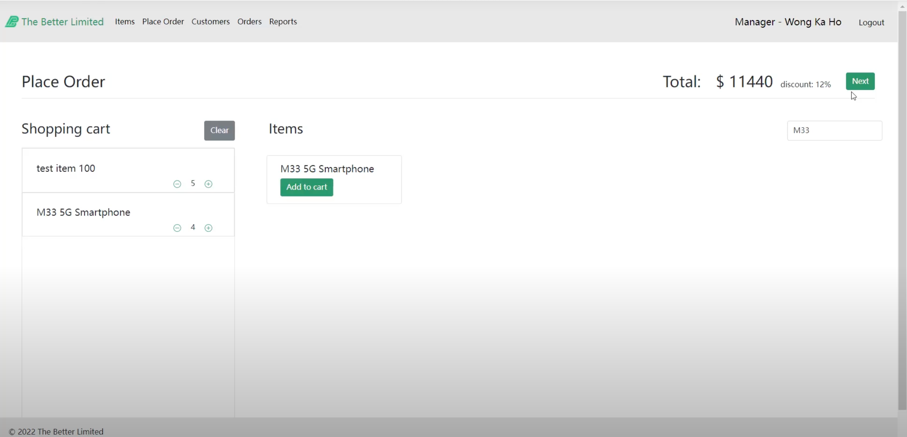
(Salesperson search for items by name)
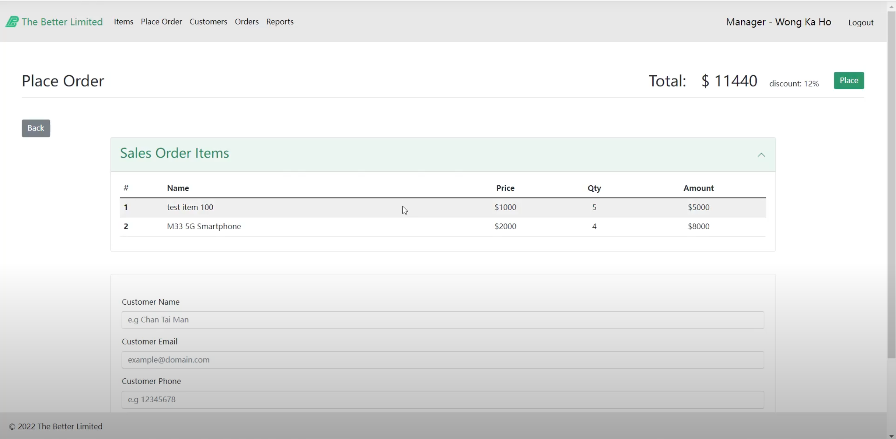
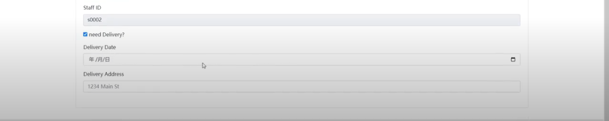
(The salesperson can choose need delivery, and input group will be shown)
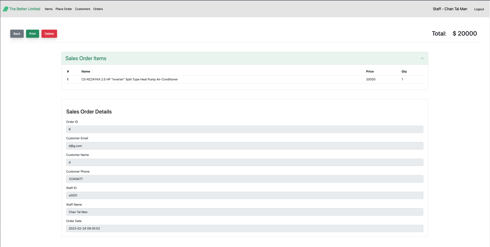

- View orders of the customer

  - All orders
    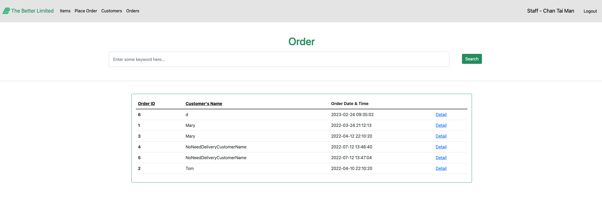
    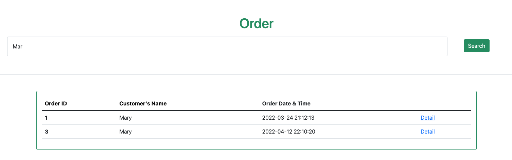
    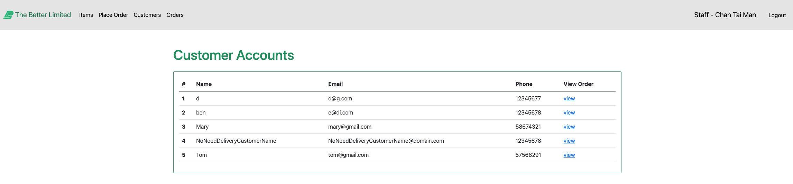
    (Search orders by customer)

  - Order Details
    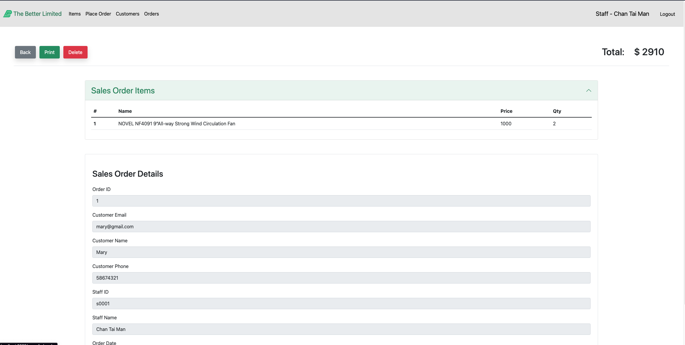
    

- Update order delivery status (There are Edit button in the order details page)
    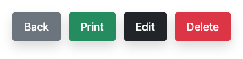
    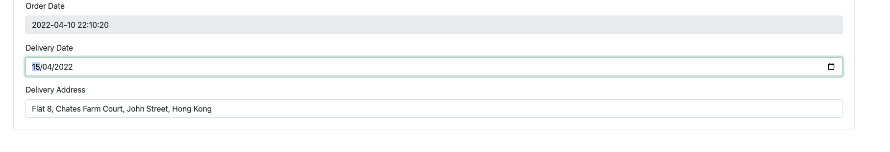
    

- Add Goods
    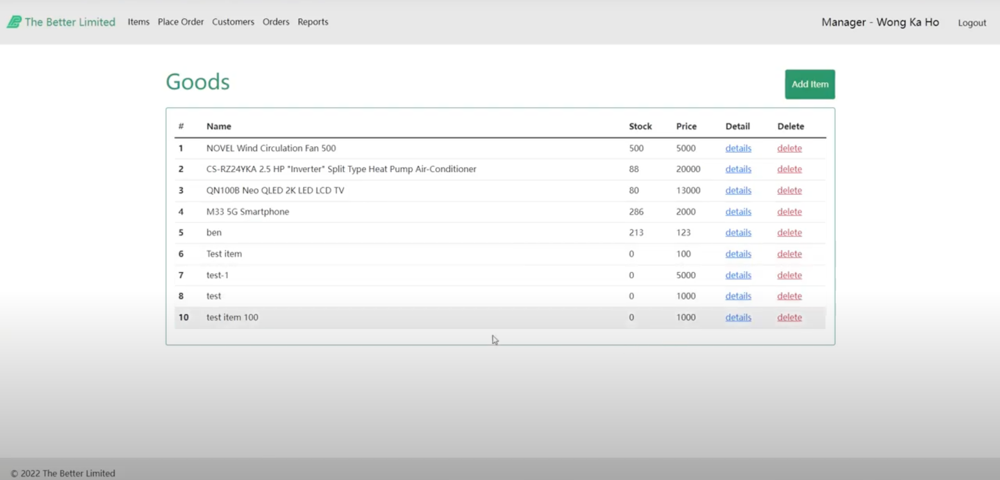
    
    (Staff can only view the item, but cannot edit or delete it)
    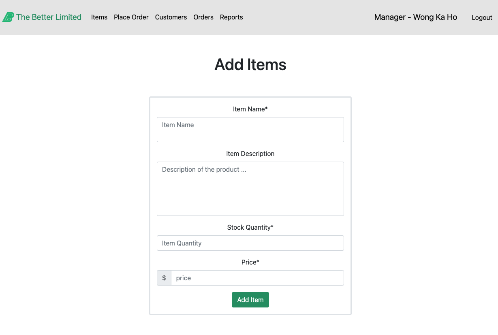

- Monthly Report
    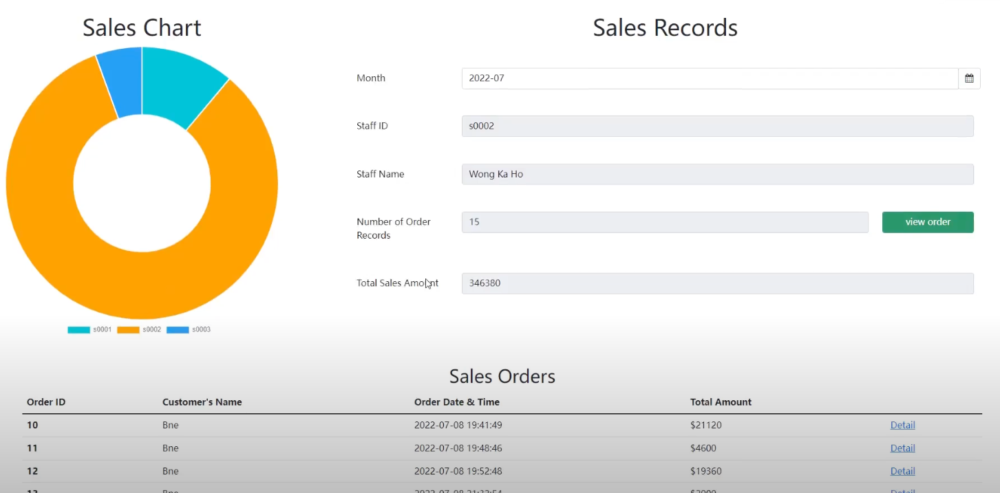
